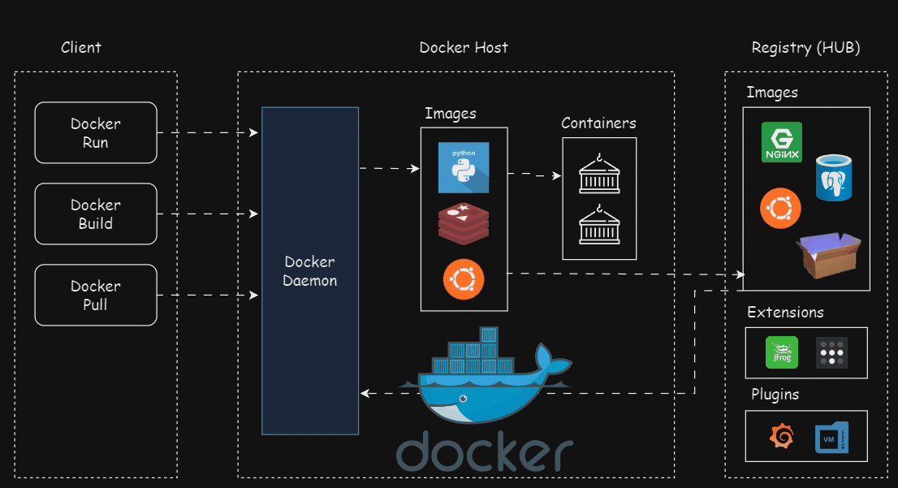
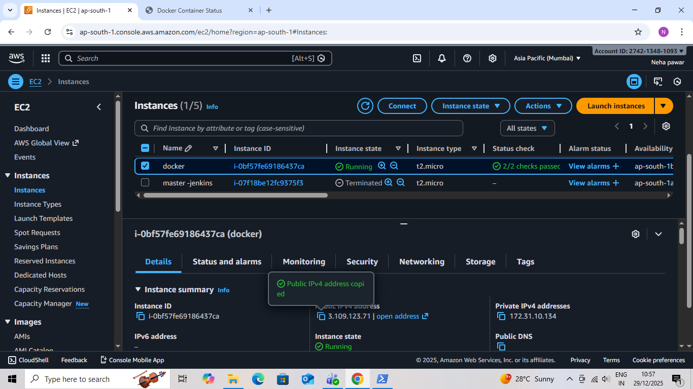
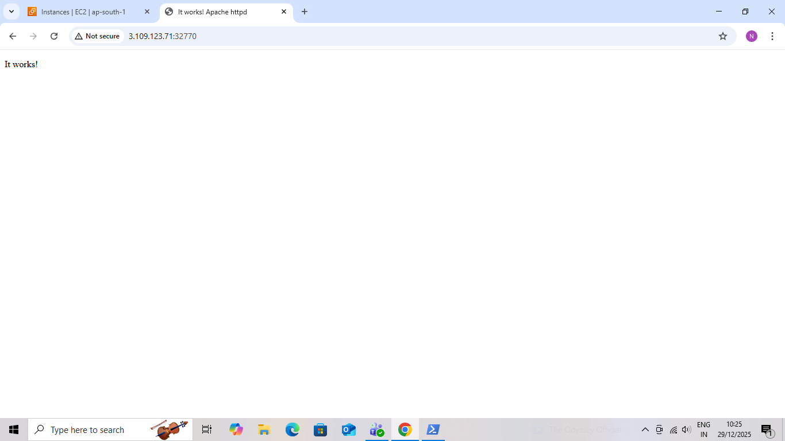
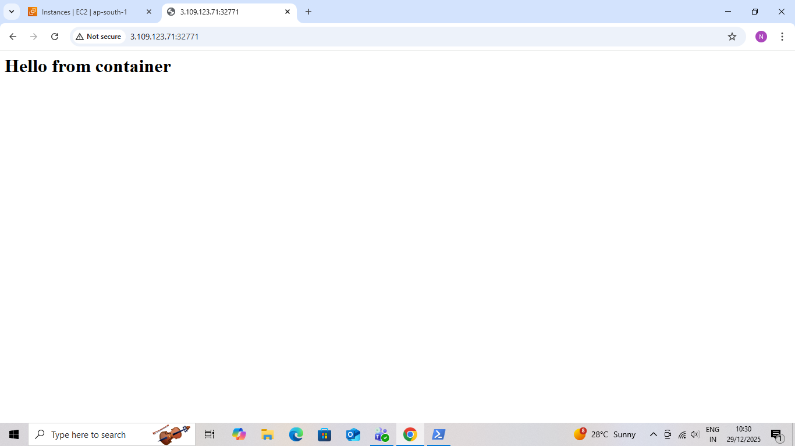

# Docker Nginx Deployment on AWS EC2 

A professional DevOps project demonstrating how to deploy a Dockerized web application using Nginx on an AWS EC2 instance.

This project focuses on Docker fundamentals, containerized deployments, and hosting a live application on the cloud.

---

##  Project Overview

This project demonstrates how a static web application is containerized using Docker and served via Nginx on an AWS EC2 instance.

The application runs inside a Docker container and is accessible publicly using the EC2 public IP and mapped port.

---

##  Technologies Used

- AWS EC2
- Docker
- Nginx
- HTML & CSS
- Amazon Linux
- Git & GitHub 

##  Dockerfile Description

- Uses the official Nginx base image  
- Copies the custom HTML file to Nginx web directory  
- Serves the application on port 80  

---

##  Deployment Steps

### 1. Launch EC2 Instance
- Instance type: t2.micro  
- OS: Amazon Linux  
- Open ports:
  - 22 (SSH)
  - Custom application port (example: 32771)

---

### 2. Install Docker on EC2

sudo yum update -y  
sudo yum install docker -y  
sudo systemctl start docker  
sudo systemctl enable docker  
sudo usermod -aG docker ec2-user  

---

### 3. Build Docker Image

docker build -t nginx-app .

---

### 4. Run Docker Container

docker run -d -p 32771:80 nginx-app

---

##  Access the Application

http://<EC2-PUBLIC-IP>:32771

Example:  
http://3.109.123.71:32771

---

##  Output

 Application deployed successfully using Nginx  
 Docker container is LIVE & HEALTHY  
 Hosted on AWS EC2  
 Accessible via public IP  

---

##  Screenshots Included

- EC2 instance running state  

- Apache HTTPD Default Page Verification

- Containerized Application Output

- Application running in browser 

---

##  Key Learnings

- Docker installation and setup  
- Writing Dockerfiles  
- Building Docker images  
- Running containers with port mapping  
- Deploying containerized applications on AWS EC2  
- Using Nginx as a web server inside Docker  

---

##  Future Enhancements

- Docker Compose setup  
- CI/CD pipeline using Jenkins  
- HTTPS configuration  
- Deployment using AWS ECS  

---

##  Author

Neha Pawar  

GitHub: https://github.com/Iamnehapawar 

---

